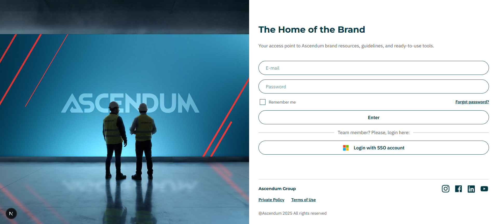
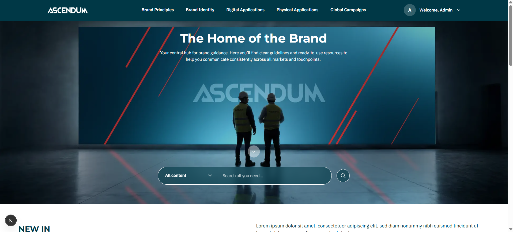
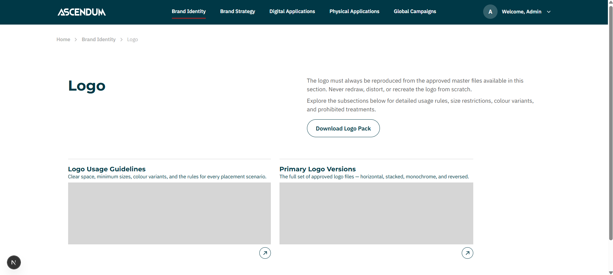
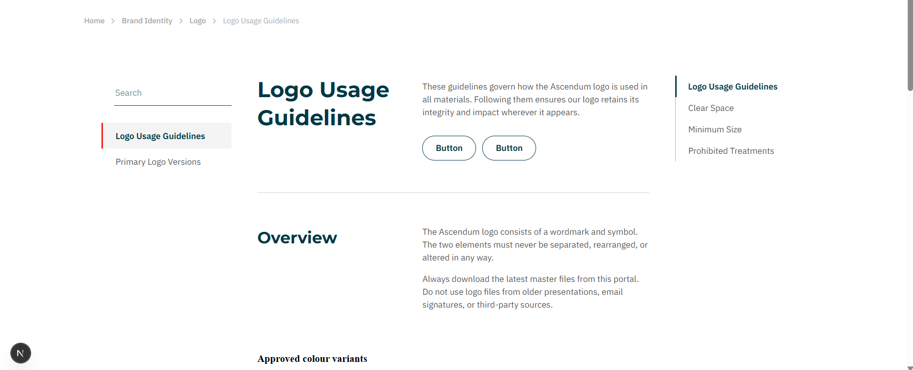
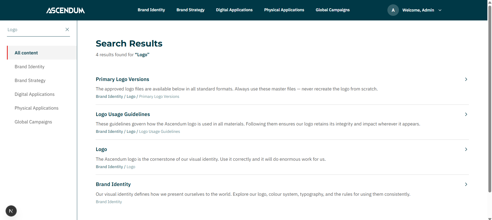
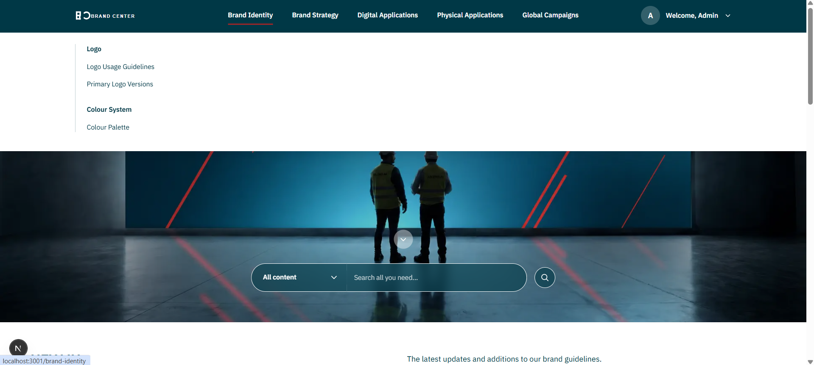
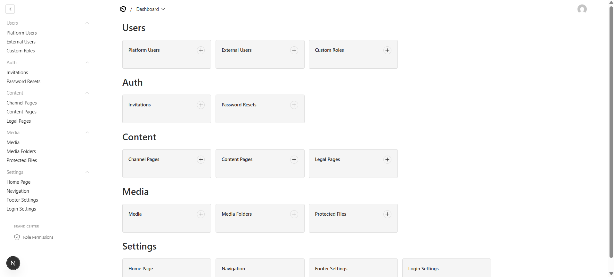
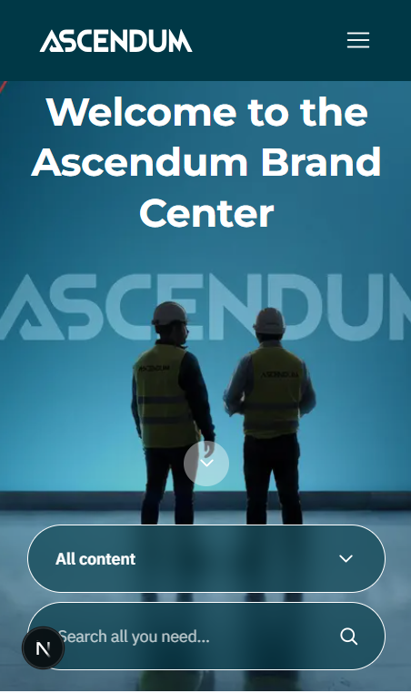

# Brand Center — Payload CMS + Next.js

A private digital platform centralising brand guidelines and assets for a multi-brand corporate group. Internal staff authenticate via Azure AD SSO; external partners are invited by admins and authenticate with email and password. A private digital platform centralising brand guidelines and assets for a multi-brand corporate group. Internal staff authenticate via Azure AD SSO; external partners are invited by admins and authenticate with email and password. Built as a parallel implementation alongside a WordPress version — same functional requirements, same Figma designs, same Confluence specifications — implemented on a different technology stack to evaluate AI-assisted development across different CMS environments.

---

## Overview

Brand Center gives a corporate group and its sub-brands a single authenticated space for brand guidelines, downloadable assets, and editorial content. The platform serves two distinct user types: internal collaborators who sign in via Microsoft Azure AD, and invited external users — agencies, suppliers, and partners — who use Payload's built-in email+password auth.

Content is entirely CMS-driven through Payload's Admin UI. Editors build pages from a library of 10 block types using the Lexical rich text editor. A three-level navigation tree managed as a Payload global drives every nav component simultaneously — mega-menu, mobile menu, left sidebar, and breadcrumb — from a single source of truth.

---

## Screenshots

| | |
|---|---|
|  |  |
| Login — SSO + email/password | Homepage — New In + Quick Access |
|  |  |
| Channel page — child card grid | Content page — block layout + anchor bar |
|  |  |
| Search results | Mega-menu — 3-level navigation |
|  |  |
| Payload Admin — content management | Mobile menu |

---

## Key Features

**Dual Authentication and Role System**
Internal users authenticate via Azure AD OAuth through a custom callback route. External users are invited by admins and authenticate with Payload's built-in email+password. Four roles — Admin, Local Admin, Internal, External — control what each user can access. All role assignments live in Payload collections, not in Azure AD.

**Secure Token Flows**
Invite links, password recovery, and admin-initiated resets share the same pattern: a SHA-256 hashed token stored in a dedicated Payload collection with a 24-hour expiry and a `used` flag. Raw tokens are never persisted.

**Block-Based Content Pages**
Editors build pages from 10 block types — rich text (Lexical), image, quote, note/callout, table, grid, download, FAQ accordion, divider, and collection card. All editorial content is Payload-driven with no hardcoded copy in components.

**Navigation-Driven Layout**
A three-level navigation tree lives in a single Payload global and simultaneously drives the mega-menu, mobile menu, left sidebar, and breadcrumb. Changing the tree in the Admin UI updates every layout component at once.

**Protected File Downloads**
Brand assets live in a separate `protectedFiles` collection. A custom API route verifies the session before streaming the file — unauthenticated requests are rejected before the stream opens.

**Transactional Email**
Four email triggers — invite, password recovery, admin-initiated reset, contact form — all route through a single Nodemailer transporter configured from environment variables. No email logic is duplicated across routes.

---

## Tech Stack

| Layer | Technology | Rationale |
|---|---|---|
| Framework | Next.js 14 (App Router) | Server Components + Route Handlers in one deploy |
| CMS / Backend | Payload CMS 3.x | Collections, globals, blocks, access control, and Admin UI in one package |
| Database | PostgreSQL via Drizzle ORM | `@payloadcms/db-postgres` — typed queries, migrations managed by Payload |
| Auth — Internal | Azure AD OAuth (custom route) | SSO for internal users without storing passwords |
| Auth — External | Payload built-in email+password | Invite-only onboarding with Payload managing hashing and sessions |
| Styling | CSS Modules + CSS custom properties | Scoped styles, design tokens via variables — no Tailwind |
| Language | TypeScript strict | End-to-end types from Payload-generated `payload-types.ts` |
| Email | Nodemailer via SMTP | Single transporter reused across all email triggers |
| Deployment | Docker + AWS ECR/EC2 | Bitbucket Pipelines CI/CD with automatic security group management |

---

## Architecture

```
Browser (React Client Components)
        ↕  Custom API routes  /api/...
Next.js App Router + Payload CMS 3.x
        ↕  Payload Local API (no HTTP — direct function call)
PostgreSQL (Drizzle ORM)
        ↕
Local filesystem (media)     Azure AD (SSO)     SMTP (email)
```

**Key architectural principles:**

- Payload runs **inside** Next.js — one deploy, shared TypeScript types generated automatically via `npm run generate:types`
- All content queries use the **Payload Local API** server-side — no HTTP round-trips between the frontend and the CMS
- Authentication converges on a single **`payload-token` JWT cookie** regardless of login method (SSO or email+password)
- The **middleware** (Edge runtime) decodes the JWT structurally and enforces role-based route access before any page renders
- Every secure token (invite, reset) is **SHA-256 hashed before storage** — the raw token only ever exists in the email link

---

## AI Integration

This project was built entirely using **Claude Code** (Anthropic's CLI agent) as the primary implementation tool, driven by a structured prompt library approach.

The repository includes a `CLAUDE.md` file — a persistent context document that Claude Code reads at the start of every session. It encodes the full technical specification, design token values, coding conventions, branch naming rules, and a 6-step per-requirement workflow connecting three MCP-integrated tools:

1. **Confluence MCP** — fetches the functional specification for each requirement
2. **Figma MCP** — reads component designs and design tokens directly from the Figma file
3. **Miro MCP** — accesses IA diagrams and navigation flow specs

Each feature was implemented by prompting Claude Code with a requirement reference (e.g. "implement A02 — invite flow"). Claude would fetch the Confluence spec, read the Figma design, implement the feature end-to-end, and commit to the correct feature branch — all in one session.

`PROMPTS.md` (in this repository) documents every feature that was built — implementation notes, file locations, and extension guides — structured as a reference for future Claude Code sessions.

---

## Project Structure

```
src/
├── app/
│   ├── (auth)/                             — Unauthenticated pages
│   │   ├── login/                          — Custom login (A01)
│   │   ├── set-password/                   — Invite onboarding (A02)
│   │   ├── reset-password/                 — Password recovery (A03)
│   │   └── expired-link/                   — Token expiry feedback
│   ├── (platform)/                         — Authenticated shell
│   │   ├── layout.tsx                      — Header + Footer + auth guard
│   │   ├── page.tsx                        — Homepage (B01)
│   │   ├── [...slug]/page.tsx              — Channel (C01) or Content (C02)
│   │   ├── search/                         — Full-text search (D01)
│   │   ├── contact/                        — Contact form (E01)
│   │   ├── faqs/                           — FAQ page (E02)
│   │   └── change-password/                — Change password (A05)
│   ├── (public)/                           — Unauthenticated legal pages (E03)
│   └── api/
│       ├── invite/                         — Invite creation + redemption
│       ├── reset-password/                 — Recovery request + confirm
│       ├── admin-reset-password/           — Admin-initiated reset (A04)
│       ├── change-password/                — Authenticated password change
│       ├── download/[fileId]/              — Protected file streaming
│       ├── logout/                         — Session teardown
│       └── users/oauth/callback/azure/     — Azure AD OAuth callback
├── components/
│   ├── layout/                             — Header, Footer, MegaMenu, MobileMenu,
│   │                                         LeftSidebar, Breadcrumb, AnchorBar
│   ├── blocks/                             — Blocks.tsx dispatcher + 10 block components
│   ├── auth/                               — LoginForm, InviteForm, ResetPasswordForm,
│   │                                         SetPasswordForm, ChangePasswordForm
│   └── homepage/                           — HomepageHero, HomepageNewIn, HomepageQuickAccess
├── payload/
│   ├── collections/                        — platformUsers, externalUsers, invitations,
│   │                                         passwordResets, channelPages, contentPages,
│   │                                         legalPages, media, protectedFiles
│   ├── globals/                            — homePage, navigation, footerSettings, loginSettings
│   ├── blocks/                             — richText, imageBlock, quoteBlock, noteBlock,
│   │                                         tableBlock, gridBlock, collectionCardBlock,
│   │                                         downloadBlock, dividerBlock, faqBlock
│   └── payload.config.ts
├── lib/
│   ├── auth.ts                             — Session helpers + Azure AD OAuth logic
│   ├── email.ts                            — Nodemailer transporter + all email templates
│   ├── payload.ts                          — getPayload() helper for Local API
│   └── tokens.ts                           — SHA-256 token generation and verification
└── styles/
    └── tokens.css                          — CSS custom properties (colours, typography)
```

---

## Getting Started

```bash
git clone https://github.com/lourencosilvabeato/Brand-Center---Payload.git
cd Brand-Center---Payload
npm install
cp .env.example .env
# fill in DATABASE_URL and PAYLOAD_SECRET at minimum
```

**Start PostgreSQL:**

```bash
docker run -d --name brand-center-db \
  -e POSTGRES_DB=brand-center \
  -e POSTGRES_PASSWORD=yourpassword \
  -p 5432:5432 postgres:16
```

**Run dev server (Payload auto-migrates on first start):**

```bash
npm run dev
```

Open [http://localhost:3000/admin](http://localhost:3000/admin) to create the first admin user via Payload's setup flow, then go to [http://localhost:3000/login](http://localhost:3000/login) to access the platform.

For SSO testing, an Azure AD App Registration with the matching redirect URI is required. For email+password testing only, create a user directly in Payload Admin under `externalUsers`.

---

## Environment Variables

| Variable | Required | Description |
|---|---|---|
| `DATABASE_URL` | Yes | PostgreSQL connection string |
| `PAYLOAD_SECRET` | Yes | JWT signing secret — use a long random string |
| `AZURE_CLIENT_ID` | Yes (for SSO) | Azure AD App Registration client ID |
| `AZURE_CLIENT_SECRET` | Yes (for SSO) | Azure AD App Registration client secret |
| `AZURE_TENANT_ID` | Yes (for SSO) | Azure AD directory (tenant) ID |
| `AZURE_REDIRECT_URI` | Yes (for SSO) | Must match a Redirect URI registered in Azure |
| `SMTP_USER` | Yes (for email) | SMTP username / login |
| `SMTP_PASS` | Yes (for email) | SMTP password or API key |
| `EMAIL_FROM` | No | Sender address — falls back to `SMTP_USER` |
| `NEXT_PUBLIC_APP_URL` | Yes | Base URL used to build links in emails |

See `.env.example` for the complete template with descriptions.

---

## Scope and Roadmap

**Implemented:** Full authentication lifecycle (SSO, invite, password recovery, admin reset, change password, logout), block-based content pages (10 block types), channel landing pages, 3-level navigation, mega-menu and mobile menu, left sidebar and anchor bar, homepage, full-text search, contact form, protected file downloads, public legal pages, 404, and CI/CD pipeline to AWS EC2 via Docker.

**Not in scope for this implementation:** Sub-brand switching UI, analytics and usage tracking, Payload Admin customisation beyond default, and the WordPress parallel implementation (separate repository).

---

## Development Approach

- Architected and implemented with [Claude Code](https://claude.ai/code) using `CLAUDE.md` as persistent project context across sessions
- `PROMPTS.md` documents every built feature — implementation notes, file locations, and extension guides — as a reference for future sessions
- Specification-driven: each feature was implemented by fetching the Confluence spec and Figma design via MCP before writing any code
- 20+ logical feature branches with structured commit messages for full traceability
- Parallel implementation alongside a WordPress version against identical requirements — same Figma file, same Confluence specs, same functional brief
